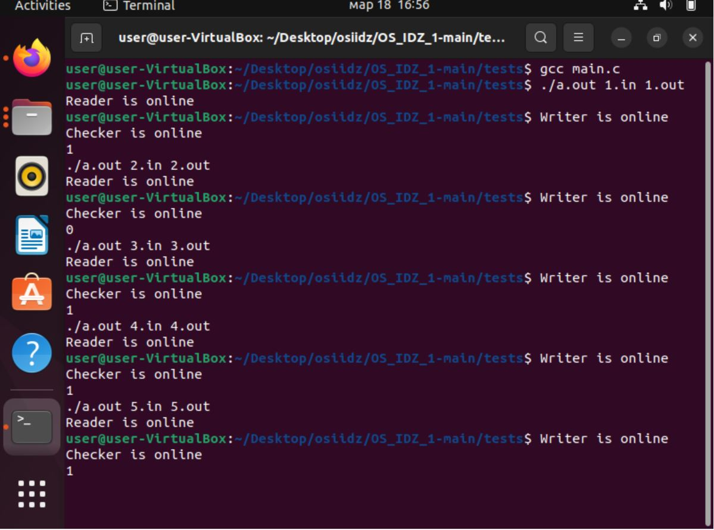

Багрянский Константин Дмитриевич

БПИ218 

Вариант 15

```
Разработать программу, которая на основе заданной ASCII-строки
символов, решает вопрос, является ли данная строка палиндромом.
```
```
input_file --> reader --|read_pipe|--> checker --|write_pipe|--> writer --> output_file
```
*Оценка 4*  **/part1**  

Программа принимает пути файлов для ввода и вывода аргументами коммандной строки.
Во входном файле содержится строка одна строка.
В выходном файле будет записано одно чилсло. 1, если строка является палиндромом и 0 если не является

Тесты */tests*

Тест 1:
```
1.in:
aaaaabaaaaa
1.out:
1
```
Тест 2:
```
2.in:
aaaaabaaaaaa
2.out:
0
```
Тест 3:
```
3.in:
1
3.out:
1
```
Тест 4:
```
4.in:
aa
4.out:
1
```
Тест 5:
```
5.in:
abbcccddddfffffddddcccbba
5.out:
1
```

**Вывод: программа работает корректно на всех тестах.**

