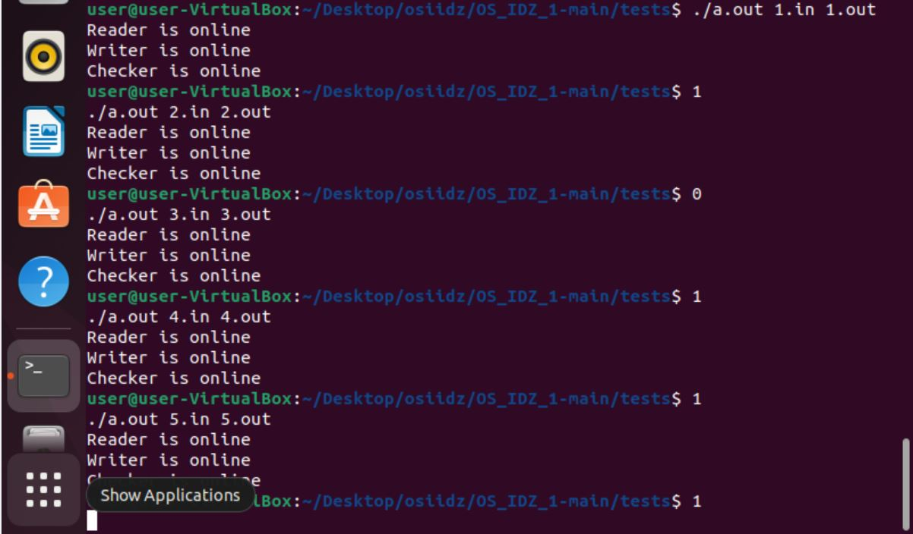
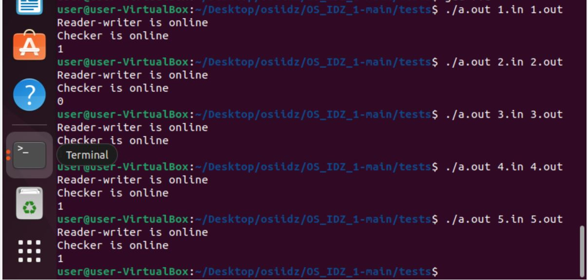
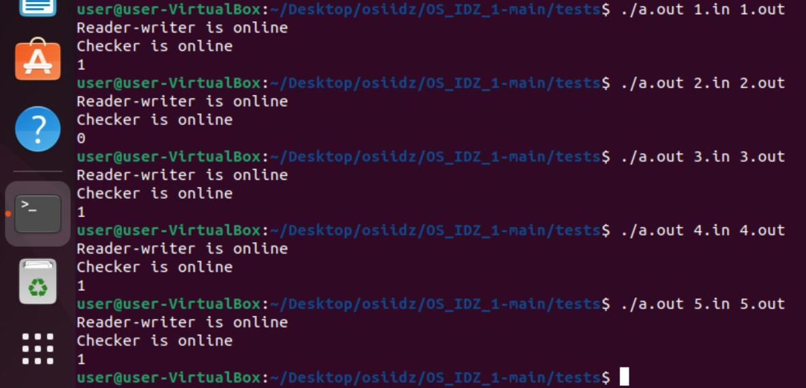

Багрянский Константин Дмитриевич

БПИ218

Вариант 15

*Оценка 4*  **/part1**

```
Разработать программу, которая на основе заданной ASCII-строки
символов, решает вопрос, является ли данная строка палиндромом.
```
```
input_file --> reader --|read_pipe|--> checker --|write_pipe|--> writer --> output_file
```

Программа принимает пути файлов для ввода и вывода аргументами коммандной строки.
Во входном файле содержится строка одна строка.
В выходном файле будет записано одно чилсло. 1, если строка является палиндромом и 0 если не является.
Ввод и вывод данных при работе с файлами осуществляется через
системные вызовы read и write.
Каналы создаются с помощью вызова pipe(...).

Тесты */tests*
В папке приведены тесты (файлы *.in и соответсвуюзие правильные ответы *.out)

В папке part1/part1_tests_results приведены результаты работы программы из папки part1

Тест 1:
```
1.in:
aaaaabaaaaa
1.out:
1
```
Тест 2:
```
2.in:
aaaaabaaaaaa
2.out:
0
```
Тест 3:
```
3.in:
1
3.out:
1
```
Тест 4:
```
4.in:
aa
4.out:
1
```
Тест 5:
```
5.in:
abbcccddddfffffddddcccbba
5.out:
1
```


**Вывод: программа работает корректно на всех тестах.**


*Оценка 5*  **/part2**

Программа принимает пути файлов для ввода и вывода аргументами коммандной строки.
Во входном файле содержится строка одна строка.
В выходном файле будет записано одно чилсло. 1, если строка является палиндромом и 0 если не является.
Ввод и вывод данных при работе с файлами осуществляется через
системные вызовы read и write.
Именованные каналы создаются с помощью вызова mknod('name', ...).
```
input_file --> reader --|read_pipe|--> checker --|write_pipe|--> writer --> output_file
```

Тесты */tests*

В папке part2/part2_tests_results приведены результаты работы программы из папки part2

Тест 1:
```
1.in:
aaaaabaaaaa
1.out:
1
```
Тест 2:
```
2.in:
aaaaabaaaaaa
2.out:
0
```
Тест 3:
```
3.in:
1
3.out:
1
```
Тест 4:
```
4.in:
aa
4.out:
1
```
Тест 5:
```
5.in:
abbcccddddfffffddddcccbba
5.out:
1
```


**Вывод: программа работает корректно на всех тестах.**


*Оценка 6*  **/part3**

Программа принимает пути файлов для ввода и вывода аргументами коммандной строки.
Во входном файле содержится строка одна строка.
В выходном файле будет записано одно чилсло. 1, если строка является палиндромом и 0 если не является.
Ввод и вывод данных при работе с файлами осуществляется через
системные вызовы read и write.
Каналы создаются с помощью вызова pipe(...).
```
input_file --->                 --|read_pipe|--->
                \             /                   \
                 reader_writer                     checker
                /             \                   /
output_file <--                 <--|write_pipe|--
```

Тесты */tests*

В папке part3/part3_tests_results приведены результаты работы программы из папки part3

Тест 1:
```
1.in:
aaaaabaaaaa
1.out:
1
```
Тест 2:
```
2.in:
aaaaabaaaaaa
2.out:
0
```
Тест 3:
```
3.in:
1
3.out:
1
```
Тест 4:
```
4.in:
aa
4.out:
1
```
Тест 5:
```
5.in:
abbcccddddfffffddddcccbba
5.out:
1
```


**Вывод: программа работает корректно на всех тестах.**


*Оценка 7*  **/part4**

Программа принимает пути файлов для ввода и вывода аргументами коммандной строки.
Во входном файле содержится строка одна строка.
В выходном файле будет записано одно чилсло. 1, если строка является палиндромом и 0 если не является.
Ввод и вывод данных при работе с файлами осуществляется через
системные вызовы read и write.
Именованные каналы создаются с помощью вызова mknod('name', ...).
```
input_file --->                 --|read_pipe|--->
                \             /                   \
                 reader_writer                     checker
                /             \                   /
output_file <--                 <--|write_pipe|--
```

Тесты */tests*

В папке part4/part4_tests_results приведены результаты работы программы из папки part4

Тест 1:
```
1.in:
aaaaabaaaaa
1.out:
1
```
Тест 2:
```
2.in:
aaaaabaaaaaa
2.out:
0
```
Тест 3:
```
3.in:
1
3.out:
1
```
Тест 4:
```
4.in:
aa
4.out:
1
```
Тест 5:
```
5.in:
abbcccddddfffffddddcccbba
5.out:
1
```


**Вывод: программа работает корректно на всех тестах.**

